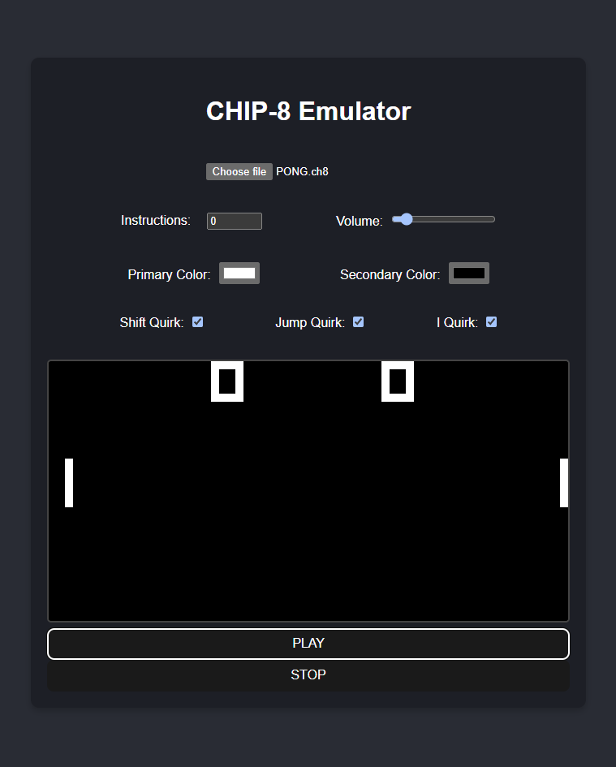

# CHIP-8 Emulator

This project is a CHIP-8 emulator built using React and TypeScript. The emulator is capable of loading and running CHIP-8 ROMs (in .ch8 or .chip8 format). Included in the project directory are 3 roms.

Use the keyboard keys below to control input:

1 2 3 4

Q W E R

A S D F

Z X C V

<p align="center">
    
</p>

## Installation

To get started with the Chip-8 emulator, follow these steps:

### Clone the repository:

```bash
git clone https://github.com/Shafin-A/chip8-emulator.git
cd chip8-emulator
```

### Install dependencies:

```bash
npm install
```

### Start the development server:

```bash
npm run dev
```

This will start the emulator on http://localhost:5173/

## Resources used

- https://tobiasvl.github.io/blog/write-a-chip-8-emulator/
- https://github.com/tobiasvl/awesome-chip-8
- https://github.com/mattmikolay/chip-8/wiki/CHIP%E2%80%908-Instruction-Set
